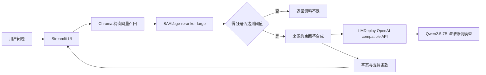

# 智能法律咨询助手

[](https://www.python.org/)
[](https://docs.llamaindex.ai/)
[](https://github.com/hiyouga/LLaMA-Factory)
[](https://streamlit.io/)
[](https://www.trychroma.com/)
[](https://lmdeploy.readthedocs.io/)
[](https://huggingface.co/Qwen)
[](https://huggingface.co/BAAI/bge-reranker-large)
[](https://pytest.org/)

一个面向中国法律条文的本地 RAG 演示项目。系统通过稠密向量召回、Cross-Encoder 重排序和相关度阈值控制，为生成模型提供可追溯的法律依据；前端使用 Streamlit，生成模型通过 LMDeploy 的 OpenAI-compatible API 接入。

> 本项目用于展示 RAG、领域微调模型接入和工程化整理思路，不构成正式法律意见，也不应直接用于高风险法律决策。

关于本项目的需求分析、技术选型及开发过程中的排错思路，我已记录于个人博客，欢迎参阅：[《法律助手项目RAG + 微调经验总结》](https://blog.mirastar.top/2026/08/25/%E6%B3%95%E5%BE%8B%E5%8A%A9%E6%89%8B%E9%A1%B9%E7%9B%AERAG+%E5%BE%AE%E8%B0%83%E7%BB%8F%E9%AA%8C%E6%80%BB%E7%BB%93/)。

## 项目特点

- **来源可追溯**：答案展示参与生成的法律名称、条款、正文和重排得分。
- **知识边界控制**：重排序结果未达到阈值时直接拒答，避免强行生成答案。
- **主体混淆治理**：提示词明确要求区分劳动者、用人单位及其他责任主体。
- **模型与应用解耦**：通过 OpenAI-compatible API 接入本地微调模型，也可替换为其他兼容服务。


## 系统架构



本项目实现的是“稠密向量召回 + Cross-Encoder 重排序”

## 目录结构

```text
legal-rag-assistant/
├── data/
│   ├── labor_laws.json       # 205 条法律条文
│   └── README.md              # 数据范围和使用边界
├── src/legal_assistant/
│   ├── config.py              # 环境变量和路径配置
│   ├── data_loader.py         # JSON 校验、规范化和节点构造
│   ├── knowledge_base.py      # Chroma 索引生命周期
│   ├── models.py              # Embedding、LLM、Reranker
│   ├── schemas.py             # 可序列化返回结构
│   ├── service.py             # 检索、重排、过滤和生成
│   └── ui.py                  # Streamlit 界面
├── tests/                     # 不下载模型的单元测试
├── .env.example
├── .gitignore
├── pyproject.toml
└── streamlit_app.py
```

## 技术选型

| 模块 | 实现 | 作用                       |
|---|---|--------------------------|
| 生成模型 | `Qwen--Qwen2.5-7B-Instruct-law` | 项目微调后的模型                 |
| 推理服务 | LMDeploy | 暴露 OpenAI-compatible API |
| Embedding | `sungw111/text2vec-base-chinese-sentence` | 中文法律条文和问题向量化             |
| 向量数据库 | Chroma | 本地持久化向量检索                |
| Reranker | `BAAI/bge-reranker-large` | 对初始召回结果进行交叉编码重排          |
| RAG 框架 | LlamaIndex | 索引、检索和答案合成               |
| 前端 | Streamlit | 对话、引用和运行信息展示             |


## 快速开始

### 1. 创建应用环境

建议使用 Python 3.10：

```bash
conda create -n legal-rag-assistant python=3.10 -y
conda activate legal-rag-assistant
python -m pip install --upgrade pip
pip install -e .
```

如需运行测试：

```bash
pip install -e ".[dev]"
pytest
```

### 2. 配置应用

复制示例配置：

```bash
# Linux / macOS
cp .env.example .env

# Windows PowerShell
Copy-Item .env.example .env
```

`.env` 中的 `LLM_MODEL` 必须与 LMDeploy `/v1/models` 返回的模型标识一致。`EMBEDDING_MODEL` 和 `RERANK_MODEL` 既可以填写 Hugging Face 模型 ID，也可以填写本地模型目录。

### 3. 启动 LMDeploy

LMDeploy 应使用独立环境安装。下面的模型路径只是占位符：

```bash
lmdeploy serve api_server /path/to/Qwen2.5-7B-Instruct-law \
  --server-port 23333
```

服务就绪后应能访问 `http://localhost:23333/v1/models`。更多参数以 [LMDeploy OpenAI-compatible server 官方文档](https://lmdeploy.readthedocs.io/en/latest/llm/api_server.html)为准。

### 4. 启动 Streamlit

```bash
streamlit run streamlit_app.py
```

首次启动会下载或加载 embedding、reranker，并在 `.cache/chroma/` 中构建向量索引。后续启动会根据 Chroma collection 的实际记录数加载已有索引。

## 配置项

| 环境变量 | 默认值 | 说明 |
|---|---|---|
| `LLM_API_BASE` | `http://localhost:23333/v1` | OpenAI-compatible API 地址 |
| `LLM_API_KEY` | `EMPTY` | 本地无认证服务使用的占位值；远程服务请在本地 `.env` 配置 |
| `LLM_MODEL` | `Qwen--Qwen2.5-7B-Instruct-law` | API 暴露的模型标识 |
| `LLM_CONTEXT_WINDOW` | `4096` | 上下文窗口 |
| `EMBEDDING_MODEL` | `sungw111/text2vec-base-chinese-sentence` | Embedding 模型 ID 或路径 |
| `RERANK_MODEL` | `BAAI/bge-reranker-large` | Cross-Encoder 模型 ID 或路径 |
| `RETRIEVAL_TOP_K` | `10` | 初始向量召回数量 |
| `RERANK_TOP_K` | `3` | 重排后最多保留数量 |
| `RERANK_SCORE_THRESHOLD` | `0.4` | 最低可接受重排得分 |
| `COLLECTION_NAME` | `chinese_labor_laws` | Chroma collection 名称 |
| `DATA_DIR` | `data` | JSON 知识库目录 |
| `CACHE_DIR` | `.cache` | 运行时索引目录 |

相对路径统一以仓库根目录解析，避免依赖启动命令所在的当前工作目录。

## 数据和索引更新

知识库包含 205 个唯一条款，覆盖《中华人民共和国劳动法》和《中华人民共和国劳动合同法》。它是静态项目数据，不会自动同步法律修订。

修改 `data/labor_laws.json` 后，需要删除旧索引再启动：

```bash
# Linux / macOS
rm -rf .cache/chroma

# Windows PowerShell
Remove-Item -LiteralPath .cache/chroma -Recurse -Force
```

删除前请确认目标确实是本仓库下的 `.cache/chroma`。应用会在下次启动时重新建库。

## 其他说明

### 为什么加入重排序

向量相似度适合扩大召回，但同一句问题可能同时命中不同责任主体的条款。Cross-Encoder 会联合阅读问题和候选条款，更适合在少量候选中重新判断相关性。

### 为什么仍然需要阈值

`top_k` 检索一定会返回若干候选，即使知识库中没有真正相关的材料。阈值把“最相似”与“足够相关”区分开，使系统可以明确拒答。阈值不是通用常数，应结合真实问题集持续评估。

### 为什么模型能力仍然重要

RAG 提供事实依据，但无法完全替代模型对提问主体、条件和条款逻辑的理解。微调、基座模型能力、检索质量和提示约束共同决定最终结果。

### 为什么不展示 `<think>`

模型内部推理文本不是面向用户的稳定接口，可能包含无关内容或敏感信息。服务层会删除 `<think>...</think>`，会话历史只保存最终答案和结构化引用。

## 测试

测试不需要 GPU，也不会下载模型：

```bash
pytest
```

覆盖范围包括：

- 数据集条款数量、唯一性和法律名称；
- 非法 JSON 结构、空内容和重复标题；
- 节点 ID 与来源元数据；
- 环境变量覆盖和错误配置；
- 阈值边界、无匹配拒答和正常回答；
- `<think>` 清理以及会话消息不保存推理内容。


